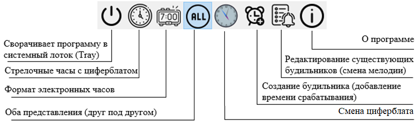
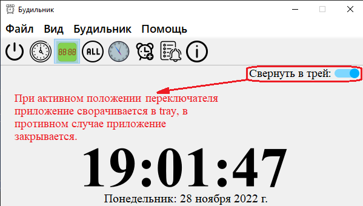
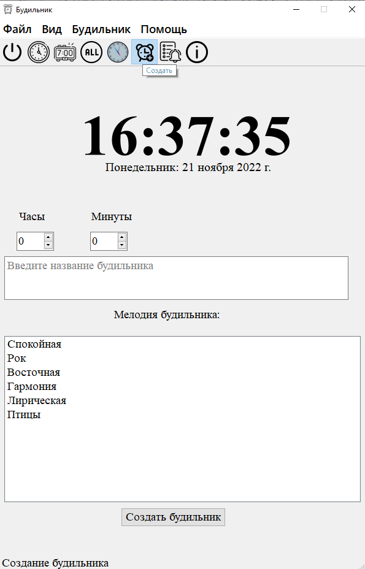
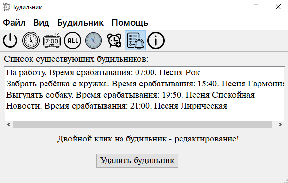
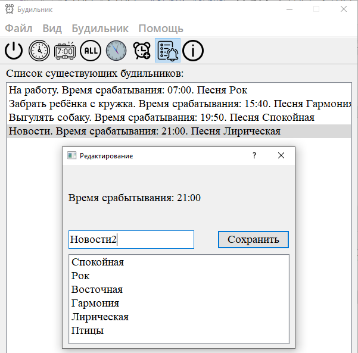
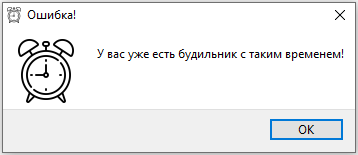
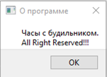
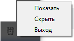
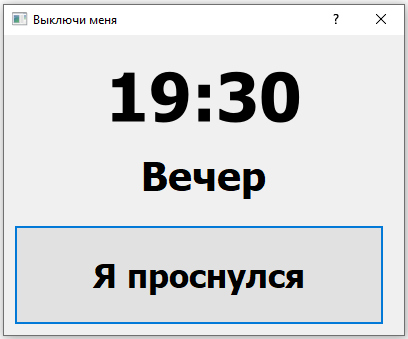
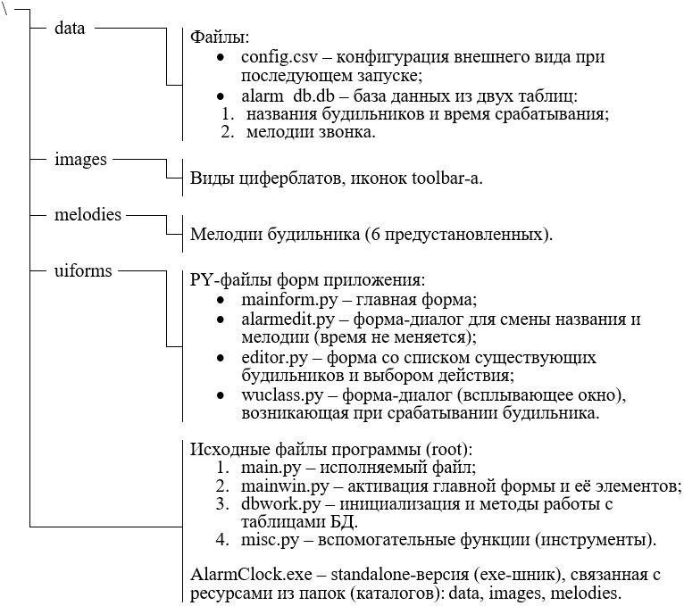

<h1>Простейшая программа «Будильник».</h1>

<h2>Краткое описание и инструкция по работе.</h2>

Программное приложение, как первый проект в качестве аттестации в Лицее Академии Яндекса.

Для запуска приложения необходимо:

* установить необходимые библиотеки запустив: pip install -r requirements.txt

* запустить файл main.py

При запуске программа представляет собой часы с двумя циферблатами, электронными
и стрелочными представлениями (возможны и отдельные виды):

Основные элементы управления (toolbar – дублируется ленточным меню):

Переключатель в правом верхнем углу отвечает за помещение программы в трей, либо за полное закрытие приложения.

Выбранный циферблат и представления (цифровые часы, аналоговые или оба вида
вместе), а также положение переключателя "Свернуть в трей" сохраняются в файле: 
**data/config.csv**.

При создании нового будильника окно принимает следующий вид:

Пользователь видит текущее время и может указать:

*   Время;
*   Имя (название) будильника;
*   Мелодию (выбор из списка).

**Примечание**:

1.  Выбор мелодии и указание имени являются обязательными;

2.  В будильнике 6 предустановленных мелодий (добавление и редактирование
    мелодий в данной версии программы не предусмотрено).

Все времена будильников хранятся в файле: data/alarm_db.db, удаление которого
сделает программу неработоспособной.

В режиме редактирования будильников пользователь может менять мелодию и название
будильника:

Для редактирования нужно дважды щёлкнуть на желаемый будильник:

В открывшемся диалоге можно поменять название и мелодию. Время срабатывания
остаётся неизменным. Название, при этом, необходимо изменить обязательно.

Для удаления нужно выбрать (выделить мышью) требуемый будильник в списке и
нажать кнопку «Удалить будильник». Удаление произойдёт без предупреждения.
Отменить удаление невозможно. Если будильник не выбран, удаления не произойдёт:

**Важно**: в списке одновременно не могут существовать два будильника с одним
именем и временем срабатывания. В противном случае программа сообщает об ошибке:

| 

 |   | 

 |
|----------------------------------------------------------|---|----------------------------------------------------------|

При выборе пункта меню «О программе» появляется информационное окошко:

При нажатии на кнопку выхода программа сворачивается в системный лоток (Tray).
Управление происходит за счёт контекстного меню трея:

При срабатывании будильника (даже если программа свёрнута в лоток), появляется
всплывающее окно:

Нажатие кнопки: «Я проснулся» прекращает действие данного будильника, и
программа продолжает отслеживать другие будильники.

Состав программы:

